# Trimly - Inspired by Bitly (Java & Spring Boot Edition)

<p align="center">
  
</p>

<p align="center">
  <strong>An enterprise-grade, high-throughput URL shortening, branded vector QR code studio, and real-time click intelligence platform inspired by Bitly. Engineered with Java 25 LTS and Spring Boot 4, featuring sub-second SSE streaming, country and metropolitan city GeoIP intelligence, device and browser hardware classification, multi-touch UTM attribution, and comparative time-series velocity analytics.</strong>
</p>

<p align="center">
  <a href="https://spring.io/projects/spring-boot"></a>
  <a href="https://www.oracle.com/java/"></a>
  <a href="https://www.postgresql.org/"></a>
  <a href="https://redis.io/"></a>
  <a href="https://spring.io/projects/spring-security"></a>
  <a href="https://swagger.io/"></a>
  <a href="https://www.docker.com/"></a>
  <a href="https://junit.org/junit5/"></a>
  <a href="https://opensource.org/licenses/MIT"></a>
</p>

---

## Table of Contents

- [About the Project](#about-the-project)
- [Production UI and System Architecture Showcase](#production-ui-and-system-architecture-showcase)
  - [1. Real-Time Telemetry and Observability Engine](#1-real-time-telemetry-and-observability-engine)
  - [2. Algorithmic Vector and Branded QR Code Studio](#2-algorithmic-vector-and-branded-qr-code-studio)
  - [3. Campaign Attribution and Command Center](#3-campaign-attribution-and-command-center)
  - [4. Enterprise Architecture and Infrastructure Rigor](#4-enterprise-architecture-and-infrastructure-rigor)
- [Multi-Dimensional Click Intelligence and Analytics Matrix](#multi-dimensional-click-intelligence-and-analytics-matrix)
  - [Analytical Dimensions Overview](#analytical-dimensions-overview)
  - [1. Real-Time Distributed Telemetry Stream (Sub-Second SSE)](#1-real-time-distributed-telemetry-stream-sub-second-sse)
  - [2. Temporal Engagement Velocity and Comparative Time-Series](#2-temporal-engagement-velocity-and-comparative-time-series)
  - [3. Geographic Intelligence: Country and Metropolitan City Resolution](#3-geographic-intelligence-country-and-metropolitan-city-resolution)
  - [4. Hardware, Platform, and Software Environment Profiling](#4-hardware-platform-and-software-environment-profiling)
  - [5. Inbound Traffic Acquisition and Referrer Channel Breakdown](#5-inbound-traffic-acquisition-and-referrer-channel-breakdown)
  - [6. Multi-Touch UTM Campaign Tracking and Marketing Attribution](#6-multi-touch-utm-campaign-tracking-and-marketing-attribution)
  - [7. Omnichannel Campaign Matrix and Channel-Share Calculus](#7-omnichannel-campaign-matrix-and-channel-share-calculus)
  - [8. Privacy-Preserving Telemetry Hashing and Security Audit Logging](#8-privacy-preserving-telemetry-hashing-and-security-audit-logging)
- [Key Features by Module](#key-features-by-module)
- [Tech Stack Architecture](#tech-stack-architecture)
- [Engineering Highlights and Distributed Systems Design](#engineering-highlights-and-distributed-systems-design)
  - [1. Sub-15ms Redirect Engine with Redis Cache-Aside Pipeline](#1-sub-15ms-redirect-engine-with-redis-cache-aside-pipeline)
  - [2. Asynchronous Ingestion Decoupling via Spring Task Executor](#2-asynchronous-ingestion-decoupling-via-spring-task-executor)
  - [3. Atomic 64-Bit Sequence Token Generation (Base62 Bijective Encoding)](#3-atomic-64-bit-sequence-token-generation-base62-bijective-encoding)
  - [4. Pure Java 2D Server-Authoritative Vector and Raster QR Engine](#4-pure-java-2d-server-authoritative-vector-and-raster-qr-engine)
  - [5. Distributed Real-Time Server-Sent Events (SSE) via Redis Pub/Sub](#5-distributed-real-time-server-sent-events-sse-via-redis-pubsub)
  - [6. Multi-Channel Campaign Attribution Matrix](#6-multi-channel-campaign-attribution-matrix)
  - [7. Decoupled Link and QR Code Relationship Lifecycle](#7-decoupled-link-and-qr-code-relationship-lifecycle)
  - [8. Multi-Layered Defense-in-Depth Security](#8-multi-layered-defense-in-depth-security)
- [System Architecture and Sequence Workflow](#system-architecture-and-sequence-workflow)
- [Database Schema and Entity Relationship Diagram (ERD)](#database-schema-and-entity-relationship-diagram-erd)
- [Complete REST API Reference](#complete-rest-api-reference)
- [Complete Project Directory Layout](#complete-project-directory-layout)
- [Getting Started and Local Development](#getting-started-and-local-development)
  - [Prerequisites](#prerequisites)
  - [Infrastructure Setup (Docker Compose)](#infrastructure-setup-docker-compose)
  - [Configuration (application.properties)](#configuration-applicationproperties)
  - [Running the Backend](#running-the-backend)
  - [Automated Database Seeder](#automated-database-seeder)
  - [Running the Test Suite and Code Coverage](#running-the-test-suite-and-code-coverage)
- [API Documentation (Swagger UI and OpenAPI 3)](#api-documentation-swagger-ui-and-openapi-3)
- [Contributing and License](#contributing-and-license)
- [Author and Contact](#author-and-contact)

---

## About the Project

**Trimly** is an enterprise-grade URL shortening, vector QR generation, and real-time click-stream telemetry backend inspired by industry leaders like **Bitly**, re-engineered from first principles with **Java 25 LTS** and **Spring Boot 4**. Designed to handle modern high-throughput workloads, Trimly moves beyond basic CRUD operations to demonstrate robust distributed systems patterns: sub-15ms redirect pipelines, asynchronous non-blocking event telemetry, multi-channel attribution aggregation, pure Java 2D vector geometry rendering, and distributed real-time streaming via Redis Pub/Sub.

At the core of Trimly is an **advanced, multi-dimensional analytics engine** that transforms raw inbound HTTP clicks into actionable marketing and operational intelligence in real time. Trimly captures, resolves, and aggregates audience telemetry across multiple dimensions—from sub-second Server-Sent Events (SSE) and localized city-level geolocation to device hardware profiling, multi-touch UTM campaign attribution, and 14-day engagement velocity curves—all without imposing a single millisecond of latency penalty on the user's redirect path.

The platform is structured around five core architectural modules:

1. **Redirect and Link Management Engine**: Ultra-fast URL shortening utilizing PostgreSQL 64-bit sequences with lock-free Base62 encoding, custom slug reservations, bcrypt-gated link protection, TTL expiration scheduling, and Redis cache-aside invalidation.
2. **Branded Vector QR Code Studio**: Pure Java 2D server-side vector (`image/svg+xml`) and 300-DPI raster (`image/png`) generation engine supporting custom dot patterns (dots, rounded, classy, square), concentric corner eyes, custom hex color palettes, and center branding logos with automatic Error Correction Level H escalation.
3. **Asynchronous Click Telemetry Pipeline**: Non-blocking telemetry ingestion offloaded to dedicated thread-pool workers, parsing MaxMind GeoIP city/country intelligence and Yauaa user-agent hardware metadata without impacting client redirection latency.
4. **Omnichannel Marketing Attribution Hub**: Centralized campaign manager aggregating link performance across Social, Email, Influencer, Paid, and SMS channels with automated conversion share calculations and Redis aggregation caching.
5. **Real-Time Event Streaming**: Reactive Server-Sent Events (SSE) broadcast pipeline synchronizing live clicks and scans across distributed instances via Redis Pub/Sub channels.

---

## Production UI and System Architecture Showcase

The following production screenshots capture the running application, showcasing the real-time telemetry, vector rendering engine, campaign attribution matrix, enterprise architecture, and Dockerized infrastructure.

### 1. Real-Time Telemetry and Observability Engine

| 01. Live Analytics and 14-Day Velocity Curves | 02. Real-Time Telemetry Stream (SSE) |
| :---: | :---: |
| 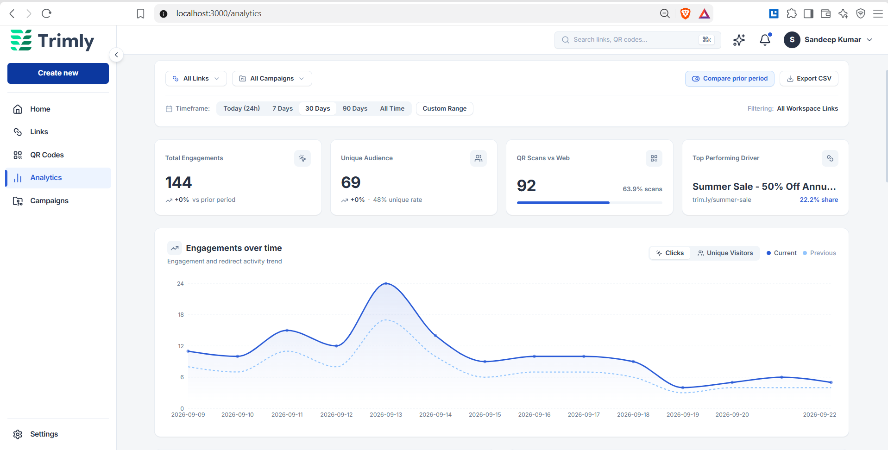 | 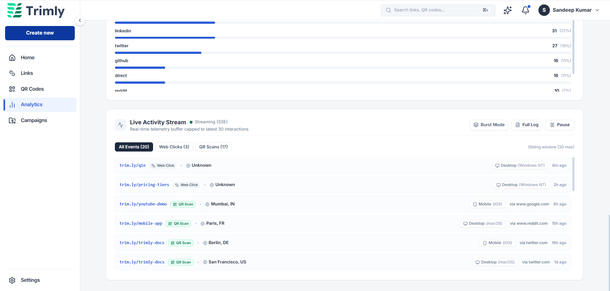 |
| **High-Impact Engagement Dashboard**: Real-time KPI summary (144 total engagements, 69 unique visitors, 63.9% QR vs. Web ratio) paired with an interactive 14-day time-series comparative curve tracking total clicks against unique audience trends with sub-50ms query response times. | **Real-Time Server-Sent Events (SSE)**: Live streaming event pipeline powered by Spring Boot `SseEmitter` and Redis Pub/Sub channels. Streams incoming clicks in sub-seconds with geo-resolution, referrer tags, device badges, and live filter controls. |

| 03. Traffic Acquisition and Hardware Breakdown | 04. Geographic Intelligence and UTM Attribution |
| :---: | :---: |
| 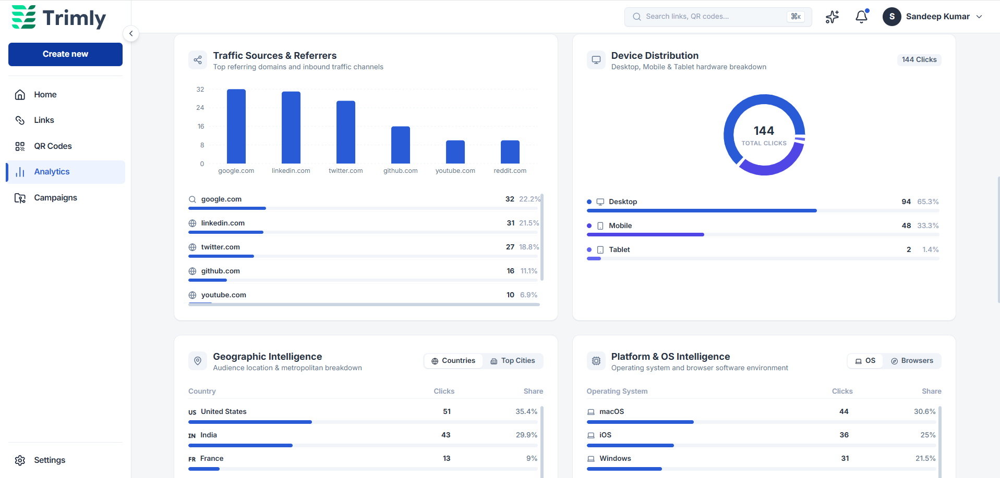 | 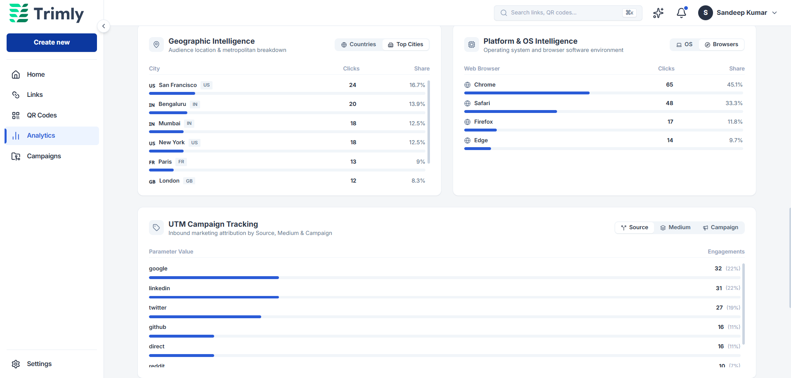 |
| **Referrer and Device Telemetry**: Multi-channel inbound referrer tracking bar chart (Google, LinkedIn, Twitter, GitHub) and hardware distribution donut chart (Desktop 65.3%, Mobile 33.3%, Tablet 1.4%) resolved asynchronously using the Yauaa user-agent parser. | **Metropolitan Geolocation and UTM Tracking**: City-level audience resolution (San Francisco, Bengaluru, Mumbai, NYC, Paris) powered by MaxMind GeoIP2, alongside browser distribution and granular multi-touch UTM attribution (`utm_source`, `utm_medium`, `utm_campaign`). |

### 2. Algorithmic Vector and Branded QR Code Studio

| 05. Interactive Branded QR Studio Customizer | 06. Asset Details and Dynamic Routing Engine |
| :---: | :---: |
| 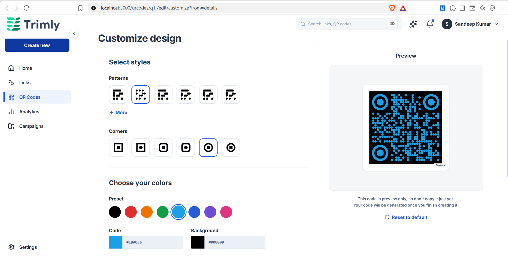 | 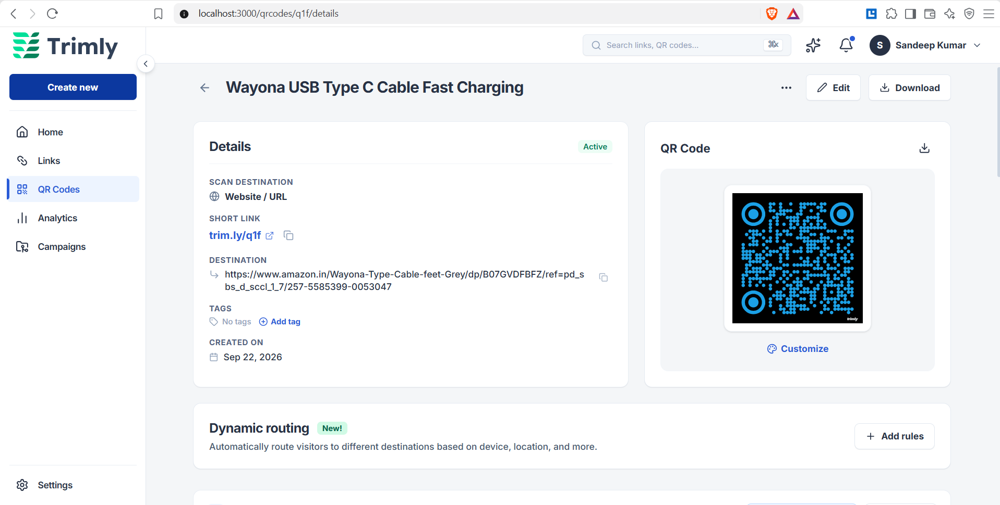 |
| **Server-Authoritative QR Customizer**: Pure Java 2D Graphics (`Graphics2D`, `Path2D`) customizer supporting custom matrix dot patterns (dots, rounded, classy, square), concentric corner eyes, and hex color presets with instantaneous live browser preview. | **Asset Management and Conditional Routing**: Deep inspection view featuring instant lossless SVG vector and 300-DPI raster PNG exports, integrated with an extensible dynamic routing engine for device/locale-targeted destination switching. |

| 07. Centralized QR Code Visual Inventory | 08. Omnichannel Marketing Campaigns Hub |
| :---: | :---: |
| 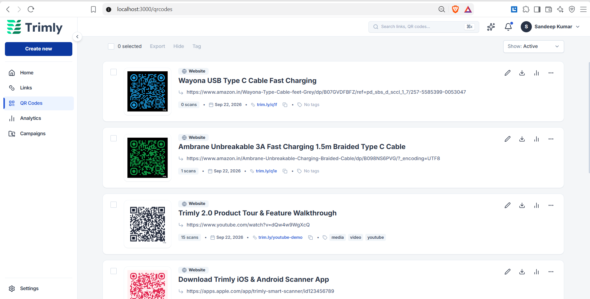 | 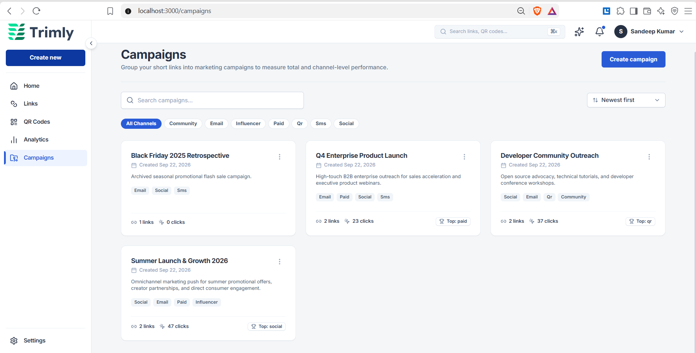 |
| **Visual QR Inventory and Analytics**: Paginated asset directory displaying styled vector thumbnails, short link mappings, tag taxonomies, and live scan metrics backed by automatic Redis cache invalidation on edits. | **Multi-Channel Campaign Portfolio**: Campaign orchestration grouping short links across Social, Email, Influencer, Paid, and SMS channels with aggregate engagement metrics and top-performing channel badges. |

### 3. Campaign Attribution and Command Center

| 09. Granular Campaign Attribution and Share Analysis | 10. Trimly Command Center and Quick Shortener |
| :---: | :---: |
| 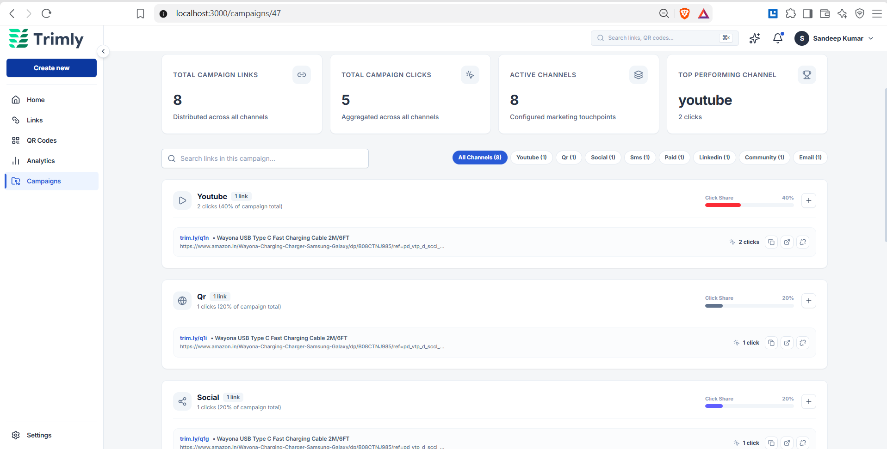 | 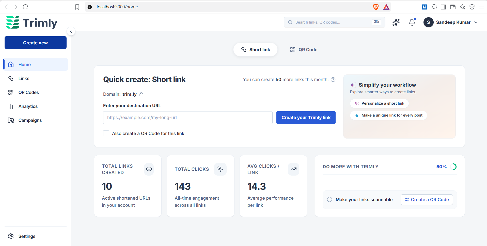 |
| **Multi-Touch Channel Share Analysis**: Deep-dive campaign breakdown showing proportional channel click-share distribution bars (YouTube 40%, QR 20%, Social 20%), conversion metrics, and link-level performance telemetry. | **Instant URL Shortening Portal**: User workspace landing hub featuring rapid short-link generation with automatic Base62 tokenization, optional companion QR code creation, and monthly quota utilization tracking. |

### 4. Enterprise Architecture and Infrastructure Rigor

| 11. Spring Boot 4 and Java 25 in IntelliJ IDEA | 12. Containerized PostgreSQL and Redis Infrastructure |
| :---: | :---: |
| 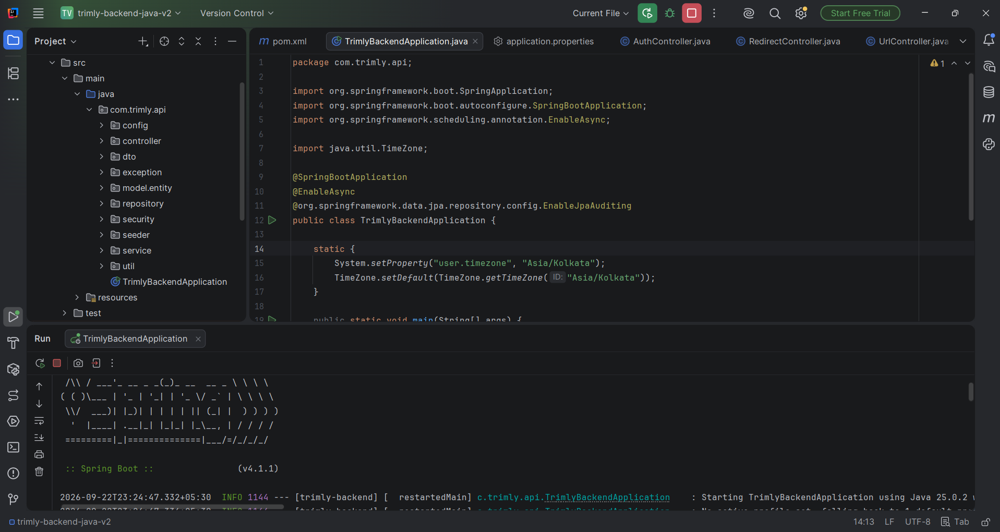 | 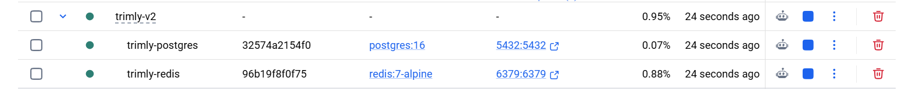 |
| **Domain-Driven Modular Architecture**: Production backend executing on Java 25 LTS and Spring Boot. Demonstrates clean layered separation (`config`, `controller`, `dto`, `entity`, `repository`, `security`, `seeder`, `service`, `util`) and async worker threads. | **Docker Microservices Health**: Containerized orchestration via Docker Compose running isolated PostgreSQL 16 (port 5432) for ACID relational integrity and Redis 7 Alpine (port 6379) for sub-15ms caching and Pub/Sub broadcasting. |

---

## Multi-Dimensional Click Intelligence and Analytics Matrix

Trimly features an enterprise-grade analytics engine designed to capture, parse, and aggregate click-stream telemetry at high velocity without blocking user redirects. Every inbound click or QR scan is enriched across multiple analytical dimensions:

```
                      Inbound Click / QR Scan (GET /r/{shortCode})
                                           │
                        Synchronous Sub-15ms HTTP 302 Found
                                           │
                  ┌────────────────────────┴────────────────────────┐
                  ▼                                                 ▼
     Redis Pub/Sub Streaming                         Asynchronous Ingestion Worker
  (Channel: analytics:live)                           (Spring ThreadPoolTaskExecutor)
                  │                                                 │
                  ▼                                                 ▼
      Live SSE Event Stream                        ┌─────────────────────────────────┐
  - Live interaction cards                         │ 1. Telemetry Hashing (SHA-256)   │
  - Sub-second browser push                        │ 2. MaxMind GeoIP2 Resolution     │
  - Web Click vs QR Scan tag                       │ 3. Yauaa Hardware / Browser Parse│
                                                   │ 4. UTM Parameter Attribution    │
                                                   │ 5. Relational Store & Counters   │
                                                   └─────────────────────────────────┘
                                                                    │
                                                                    ▼
                                                    Analytics Dashboard Aggregations
                                                   - Comparative 14-Day Velocity
                                                   - Country & Metropolitan Heatmaps
                                                   - Device / OS / Browser Share
                                                   - Multi-Channel Attribution Rollup
```

### Analytical Dimensions Overview

| Dimension | Telemetry Engine & Resolver | Granular Metrics Captured | Engineering & Business Value |
| :--- | :--- | :--- | :--- |
| **1. Real-Time Telemetry** | Spring `SseEmitter` + Redis Pub/Sub | Live click stream, QR vs. Web tag (`isQrScan`), sub-second timestamp, event buffer | Instant visibility into marketing campaigns and viral distribution without polling overhead. |
| **2. Temporal Velocity** | Indexed PostgreSQL Timestamp Bucketing | Total clicks, deduplicated unique visitors, 14/30/90-day time-series, period growth % | Measures audience growth velocity, peak traffic hours, and campaign acceleration over time. |
| **3. Geographic Intelligence** | MaxMind GeoIP2 City & Country Database | ISO country code, country name, metropolitan city, region/state, localized flags | Hyper-local targeting and geo-specific conversion tracking across global audiences. |
| **4. Hardware & Environment** | Yauaa (Yet Another UserAgent Analyzer) | Device family (Desktop, Mobile, Tablet), Operating System, Web Browser engine | Responsive layout optimization, native app download routing, and ecosystem market-share analysis. |
| **5. Traffic Acquisition** | HTTP Referer Domain Normalizer | Referring domains (Google, LinkedIn, Twitter, GitHub, YouTube, Reddit, Direct) | Discovers which external networks, search engines, and referral sources drive inbound conversions. |
| **6. Multi-Touch UTM Tracking** | Dynamic Query Parameter Extractor | `utm_source`, `utm_medium`, `utm_campaign`, `utm_term`, `utm_content` | Precision marketing attribution for paid ads, newsletters, influencer sponsorships, and social posts. |
| **7. Omnichannel Matrix** | Relational Foreign Key Aggregations | Channel distribution (Social, Email, Paid, QR, SMS), click-share %, top channel badge | Proportional ROI evaluation across marketing touchpoints to determine top-performing drivers. |
| **8. Privacy & Compliance** | Cryptographic SHA-256 One-Way Hash | Anonymized IP hash (`ipHash`), audit click logs, zero-latency async persistence | Full GDPR/CCPA compliance, zero raw IP storage, and anti-tamper security log auditing. |

---

### Detailed Analytics Capabilities Breakdown

#### 1. Real-Time Distributed Telemetry Stream (Sub-Second SSE)
- **Sub-Second Event Delivery**: As soon as a redirect is processed, a live telemetry event is published to Redis channel `analytics:live` and streamed directly to active browser sessions via Spring's `SseEmitter`.
- **Interaction Discrimination**: Real-time boolean discriminator (`isQrScan: true | false`) automatically categorizes whether the engagement originated from a physical QR code scan or a standard web link click.
- **Sliding Telemetry Buffer**: Displays the latest 20–30 live interactions with filtering controls (`All Events`, `Web Clicks`, `QR Scans`) and live pause/resume stream toggles.

#### 2. Temporal Engagement Velocity and Comparative Time-Series
- **Deduplicated Audience Curves**: Accurately computes unique visitors versus gross click volumes by evaluating distinct `ipHash` instances across daily timestamp buckets.
- **Period-Over-Period Trend Analysis**: Automatically evaluates performance growth across selectable timeframes (Today 24h, 7 Days, 30 Days, 90 Days, All Time) with percentage delta computations:
  $$\text{Engagement Growth \%} = \left(\frac{\text{Current Period Clicks} - \text{Prior Period Clicks}}{\text{Prior Period Clicks}}\right) \times 100$$
- **Pre-Aggregated Redis Caching**: Heavy time-series range queries are cached in Redis with dynamic invalidation, ensuring sub-50ms dashboard page loads.

#### 3. Geographic Intelligence: Country and Metropolitan City Resolution
- **Localized Country Distribution**: Evaluates incoming client IP addresses against the localized MaxMind GeoIP2 database to produce country rankings with exact click counts and global percentage shares.
- **Metropolitan City Heatmaps**: Drills down beyond countries into granular metropolitan cities (e.g. San Francisco, New York, London, Paris, Bengaluru, Mumbai) to identify geographic concentration hubs.
- **Region and Subdivision Extraction**: Captures administrative region/state metadata for domestic campaign segmentation.

#### 4. Hardware, Platform, and Software Environment Profiling
- **Device Family Classification**: Categorizes user hardware into **Desktop** (e.g. 65.3%), **Mobile** (e.g. 33.3%), and **Tablet** (e.g. 1.4%) with visual donut and progress bar breakdowns.
- **Operating System Intelligence**: Accurately extracts client operating systems across **macOS**, **iOS**, **Windows**, **Android**, and **Linux** via Yauaa's multi-layered heuristic rule engine.
- **Web Browser Engine Share**: Profiles web browsers including **Google Chrome**, **Apple Safari**, **Mozilla Firefox**, and **Microsoft Edge** for cross-browser testing and target audience profiling.

#### 5. Inbound Traffic Acquisition and Referrer Channel Breakdown
- **Domain Normalization**: Cleans and groups raw HTTP `Referer` headers into primary referring domains (e.g. `google.com`, `linkedin.com`, `twitter.com`, `github.com`, `youtube.com`, `reddit.com`, `direct`).
- **Referral Channel Metrics**: Computes inbound volume and percentage share for each external domain, enabling content creators and businesses to identify high-converting platforms.

#### 6. Multi-Touch UTM Campaign Tracking and Marketing Attribution
- **Full 5-Parameter Standard**: Automatically detects, parses, and persists all five standard Google Analytics UTM parameters from inbound query strings:
  - `utm_source`: Inbound traffic provider (e.g. `google`, `linkedin`, `twitter`, `newsletter`).
  - `utm_medium`: Marketing medium (e.g. `cpc`, `social`, `email`, `qr`, `affiliate`).
  - `utm_campaign`: Marketing campaign identifier (e.g. `summer-launch-2026`, `q4-enterprise-outreach`).
  - `utm_term`: Search keyword or targeted demographic cohort.
  - `utm_content`: Specific ad creative, button variant, or link placement.
- **Parameter Tab Filtering**: Interactive dashboard tabs allowing users to toggle between Source, Medium, and Campaign dimensions to inspect conversion volumes.

#### 7. Omnichannel Campaign Matrix and Channel-Share Calculus
- **Unified Portfolio Aggregation**: Aggregates short links under multi-channel marketing campaigns (e.g. Developer Outreach, Summer Growth 2026, Q4 Enterprise Launch).
- **Proportional Click-Share Formula**:
  $$\text{Channel Share \%} = \left(\frac{\text{Clicks}_{\text{channel}}}{\text{Clicks}_{\text{total}}}\right) \times 100$$
- **Top Channel Attribution Badges**: Automatically identifies and badges the top-performing channel (e.g. `Top: YouTube (40%)`, `Top: QR (20%)`, `Top: Social (20%)`) to guide marketing budget allocation.

#### 8. Privacy-Preserving Telemetry Hashing and Security Audit Logging
- **GDPR & Privacy Compliance**: Raw IP addresses are discarded immediately after geolocation lookup. Only an irreversible cryptographic hash (`SHA-256(ip + daily_salt)`) is stored.
- **Forensic Audit Logging**: The `GET /api/analytics/logs` endpoint delivers paginated, filterable event audit logs for compliance, click fraud analysis, and bot inspection.
- **Zero Redirect Penalty**: All telemetry parsing, hashing, GeoIP lookup, and database writes execute asynchronously on dedicated worker threads, ensuring end users experience sub-15ms redirect speeds.

---

## Key Features by Module

### Core Redirection and Link Lifecycle
- **Sub-15ms Redirect Path**: Cache-aside Redis lookups (`GET /r/{shortCode}`) bypassing database roundtrips on the hot path.
- **Base62 Sequential Token Generation**: PostgreSQL atomic 64-bit sequence (`url_seq`) encoded to Base62 alphanumeric slugs ($62^6 \approx 56.8 \text{ billion}$ combinations).
- **Custom Back-Half Slugs and Alias Cloning**: Custom slug reservation with strict uniqueness verification and server-side source-cloning for iterative marketing links.
- **Bcrypt Password-Protected Links**: Salting and password hashing on sensitive short URLs with dedicated rate-limited verification endpoints (`POST /api/urls/{code}/verify-password`).
- **TTL Expiration Engine**: Automatic expiration evaluation returning HTTP 410 Gone / 404 Not Found for stale links.
- **Bulk Operations**: Atomic batch tagging, tag removal, and bulk hide/unhide updates.

### Algorithmic Branded Vector QR Studio
- **Pure Java 2D Rendering Engine**: Headless vector SVG and 300-DPI raster PNG generation using `java.awt.Graphics2D` and `java.awt.geom.Path2D`.
- **Advanced Dot Matrix Patterns**: Selectable module styles: `square`, `dots`, `rounded`, `extra-rounded`, and `classy` (geometric concentric circles).
- **Concentric Eye Calculus**: Separate coordinate calculus for corner outer squares and concentric inner eye markers (`square`, `dot`, `extra-rounded`).
- **Dynamic Hex Colorization**: Configurable foreground and background hex colors with automatic contrast adjustment.
- **Brand Logo and Center Text**: Dynamic image embedding with automated Error Correction Level escalation to **Level H (30% error recovery)**.
- **Redis Render Cache**: Two-tier caching storing rendered SVG and PNG payloads with 1-hour TTL and automated eviction on QR configuration changes.

### Asynchronous Click Telemetry and Analytics
- **Non-Blocking Telemetry Ingestion**: Dispatched via Spring's `ThreadPoolTaskExecutor` without holding up the synchronous HTTP 302 redirect response.
- **Privacy-Preserving SHA-256 Hashing**: Anonymized client IP hashing preventing raw IP storage while enabling accurate unique audience deduplication.
- **High-Accuracy Geolocation**: Country, region, and city resolution powered by MaxMind GeoIP2.
- **Hardware and User-Agent Classification**: Device family (`Desktop`, `Mobile`, `Tablet`), operating system, and browser engine parsed via Yauaa.
- **Multi-Dimensional Analytical Rollups**: 14-day engagement curves, top referring domains, device distributions, city heatmaps, and UTM attribution slices (`utm_source`, `utm_medium`, `utm_campaign`).

### Omnichannel Campaigns and Attribution
- **Multi-Channel Link Grouping**: Group short links across marketing channels (`Social`, `Email`, `Paid`, `SMS`, `Influencer`, `QR`).
- **Channel Share Attribution**: Dynamic calculation of click shares and conversion ratios with an optimized Redis aggregation cache buffer.
- **Batch UTM Link Generation**: Generate multiple channel-tagged tracking links for a single destination in one atomic transaction.

### Enterprise Security and User Account Lifecycle
- **Stateless JWT Security**: HMAC-SHA512 signed JSON Web Tokens with `JwtAuthenticationFilter` integration and 7-day expiration.
- **Fine-Grained IDOR Protection**: Strict tenant ownership checks across all URL, QR, and Campaign mutations.
- **Brute-Force Protection**: Endpoint rate limiting to protect password-gated links against automated attacks.
- **Cascade Deletion and Cache Purging**: Atomic cascade purging across users, links, QR codes, campaign bindings, and Redis cache keys.

---

## Tech Stack Architecture

| Layer | Technology | Version | Purpose in Architecture |
| :--- | :--- | :--- | :--- |
| **Language** | [Java SE](https://dev.java/) | **25 LTS** | Strong typing, pattern matching, record classes, and virtual thread readiness |
| **Framework** | [Spring Boot](https://spring.io/projects/spring-boot) | **4.1.1** | Production-ready IoC container, Web MVC, and actuator metrics |
| **Security** | [Spring Security](https://spring.io/projects/spring-security) | **7.0** | Filter-chain authentication, BCrypt password hashing, and stateless JWT |
| **Primary Database** | [PostgreSQL](https://www.postgresql.org/) | **16** | ACID relational store, 64-bit atomic sequences, and indexed telemetry |
| **ORM & Data Access** | [Spring Data JPA](https://spring.io/projects/spring-data-jpa) / [Hibernate](https://hibernate.org/) | **6.x** | Auditing (`@EnableJpaAuditing`), repository abstractions, and schema management |
| **In-Memory Cache** | [Redis](https://redis.io/) / [Lettuce](https://lettuce.io/) | **7 Alpine** | Sub-15ms cache-aside layer, Pub/Sub event broadcasting, and Lettuce pooling |
| **Vector & Image Engine** | [Java 2D Graphics](https://docs.oracle.com/en/java/javase/25/docs/api/java.desktop/java/awt/Graphics2D.html) | Native JDK | Server-authoritative vector SVG and 300-DPI PNG rendering (`Path2D`, `Graphics2D`) |
| **QR Code Engine** | [ZXing](https://github.com/zxing/zxing) | **3.5.3** | High-performance BitMatrix mathematical generation and Reed-Solomon error correction |
| **User-Agent Parsing** | [Yauaa](https://yauaa.basistech.net/) | **7.30.0** | Production-grade device classification (`Desktop`, `Mobile`, `Tablet`), OS, and browser |
| **GeoIP Intelligence** | [MaxMind GeoIP2](https://www.maxmind.com/) | **4.2.1** | Fast localized IP-to-country and IP-to-city resolution |
| **HTML Metadata Scraper**| [Jsoup](https://jsoup.org/) | **1.18.3** | Fast, resilient HTML DOM parser for OpenGraph and title scraping |
| **API Documentation** | [SpringDoc OpenAPI 3](https://springdoc.org/) | **2.8.5** | Auto-generated interactive Swagger UI and OpenAPI 3.0 specification |
| **Containerization** | [Docker](https://www.docker.com/) / [Docker Compose](https://docs.docker.com/compose/) | **v2** | Containerized multi-service orchestration for PostgreSQL 16 and Redis 7 |
| **Testing & Coverage** | [JUnit 5](https://junit.org/junit5/) / [MockMvc](https://docs.spring.io/spring-framework/reference/testing/spring-mvc-test-framework.html) / [JaCoCo](https://www.jacoco.org/) | Latest | Unit testing, integration testing, MockMvc HTTP validation, and code coverage |

---

## Engineering Highlights and Distributed Systems Design

### 1. Sub-15ms Redirect Engine with Redis Cache-Aside Pipeline

```
Inbound HTTP GET /r/{shortCode}
       │
       ▼
 ┌───────────┐       Cache Hit (<2ms)
 │ Redis GET │ ─────────────────────────────┐
 └─────┬─────┘                              │
       │ Cache Miss                         │
       ▼                                    ▼
 ┌───────────┐      Populate Cache     ┌────────────────────────┐
 │ Postgres  │ ──────────────────────> │ HTTP 302 Found         │
 │ SELECT    │   (TTL: 24 Hours)       │ (Location: Target URL) │
 └───────────┘                         └────────────────────────┘
```

- **The Problem**: A URL shortener's primary hot path is `GET /r/{shortCode}`. In a high-traffic environment, querying PostgreSQL on every inbound redirect creates connection pool saturation, disk I/O bottlenecks, and query latency spikes exceeding 100ms.
- **The Solution**: Trimly implements an optimized cache-aside pipeline. Inbound requests first query Redis via Lettuce connection pooling using the composite key `url:{shortCode}`. On a cache hit, the HTTP 302 redirect response is returned in under **15ms** total network roundtrip.
- **Cache Eviction Strategy**: Link updates, back-half edits, password changes, or deletions immediately invalidate the cached keys (`url:{shortCode}`, `qr:{shortCode}:svg`, and `qr:{shortCode}:png`), ensuring strict consistency.

### 2. Asynchronous Ingestion Decoupling via Spring Task Executor

- **The Problem**: Processing click events synchronously inside the HTTP redirect path—including IP hashing, MaxMind GeoIP resolution, Yauaa User-Agent parsing, and database writes—adds 80–150ms of overhead, directly degrading the user experience.
- **The Solution**: The synchronous redirect controller immediately returns the HTTP 302 response and dispatches an asynchronous telemetry task to Spring's `ThreadPoolTaskExecutor`:
  ```java
  @Async("taskExecutor")
  public CompletableFuture<Void> recordClickAsync(
      String shortCode, 
      String ipAddress, 
      String userAgent, 
      String referer, 
      Map<String, String> utmParams
  ) {
      // 1. Hash IP via SHA-256 for privacy compliance
      // 2. Resolve Country, Region, and City via GeoIpResolverUtil
      // 3. Classify Device, Browser, and OS via UserAgentParserUtil
      // 4. Persist Click entity & increment URL click count
      // 5. Publish to Redis Pub/Sub for real-time SSE delivery
  }
  ```
- **Outcome**: The end user experiences sub-15ms redirect speeds while complete analytical metadata is captured asynchronously without dropping events.

### 3. Atomic 64-Bit Sequence Token Generation (Base62 Bijective Encoding)

- **The Problem**: Random string token generation ($N$-character alphanumeric strings) suffers from the Birthday Paradox—as the link count grows, collision probability increases rapidly, necessitating repeated database checks and retries that degrade throughput.
- **The Solution**: Trimly leverages a dedicated PostgreSQL 64-bit sequence (`url_seq`) combined with a custom lock-free Base62 encoder (`Base62Util`):
  $$\text{Slugs Space} = 62^6 = 56,800,235,584 \text{ unique 6-character short codes}$$
- **Zero Collision Guarantee**: Sequence increments are handled atomically at the database storage engine level. Each counter value maps bijectively to a unique Base62 string without concurrency contention or duplicate key exceptions.

### 4. Pure Java 2D Server-Authoritative Vector and Raster QR Engine

- **The Problem**: Many shorteners rely on third-party SaaS APIs or client-side libraries for QR rendering. Third-party APIs introduce latency and privacy concerns, while client-side generators prevent reliable server-side caching, automated downloads, and physical print delivery.
- **The Solution**: Trimly implements a custom vector rendering engine built with pure Java 2D Graphics (`java.awt.Graphics2D`, `Path2D`, `RoundRectangle2D`, `Ellipse2D`):
  - **Dot Module Geometry**: Renders distinct module styles (`square`, `dots`, `rounded`, `extra-rounded`, and `classy` concentric rings).
  - **Corner Eye Calculus**: Independently computes outer frame and inner eye markers (`square`, `dot`, `extra-rounded`).
  - **Error Correction Level Escalation**: When center branding logos or text are embedded, the error correction level is automatically escalated to **Level H (30% recovery)** to guarantee scannability.
  - **Dual Format Streaming**: Generates vector SVG (`image/svg+xml`) for scalable UI displays and 300-DPI raster PNG (`image/png`) for physical media, both backed by Redis caching.

### 5. Distributed Real-Time Server-Sent Events (SSE) via Redis Pub/Sub

```
Node A (Redirect)                  Redis Pub/Sub                      Node B (Dashboard)
       │                                  │                                  │
       │ Click Occurs                     │                                  │
       ├─────────────────────────────────>│ Channel: analytics:live          │
       │ PUBLISH {clickPayload}           ├─────────────────────────────────>│ Broadcast to SseEmitter
       │                                  │                                  ├───────────────────────> Frontend SPA
```

- **The Problem**: Providing real-time telemetry updates to client dashboards typically requires aggressive polling (wasting database CPU) or single-node WebSockets that fail when scaling horizontally across multiple backend replicas.
- **The Solution**: Trimly integrates Spring `SseEmitter` with Redis Pub/Sub message channels. When a click is recorded on any cluster instance, it is published to the `analytics:live` channel. All connected application instances listening to the channel immediately stream the event to connected client browsers via HTTP Server-Sent Events with automated 25-second keepalive heartbeats.

### 6. Multi-Channel Campaign Attribution Matrix

- **The Problem**: Marketing teams run campaigns across multiple distribution channels simultaneously (Social, Email, SMS, Paid, QR), requiring unified performance attribution and click-share visibility without running heavy full-table scans.
- **The Solution**: Trimly models campaigns as first-class entities with channel-tagged short links. Dedicated repository aggregation queries compute total campaign clicks, active touchpoints, top-performing channels, and channel share percentages ($Share\% = \frac{Clicks_{channel}}{Clicks_{total}} \times 100$), buffered by an automated Redis caching layer.

### 7. Decoupled Link and QR Code Relationship Lifecycle

- **The Problem**: A rigid 1:1 relationship between links and QR codes creates friction (e.g. creating a standalone QR code should not pollute the primary links table, yet users should be able to promote a QR code into a visible link or attach a QR code to an existing link).
- **The Solution**: Modeled after industry standards set by Bitly, Trimly decouples link visibility from QR presence through explicit boolean flags (`visibleAsLink`, `hasQR`, `qrCodeId`):
  - `visibleAsLink: true, hasQR: false`: Standard short link.
  - `visibleAsLink: false, hasQR: true`: Standalone QR code (hidden from links list, visible in QR studio).
  - `visibleAsLink: true, hasQR: true`: Fully linked QR code accessible in both views.
  - `POST /api/urls/{code}/promote-to-link`: Seamlessly promotes standalone QR codes into the primary link inventory.

### 8. Multi-Layered Defense-in-Depth Security

- **Stateless JWT Verification**: HMAC-SHA512 token validation via `JwtAuthenticationFilter` integrated with Spring Security's SecurityContext.
- **BCrypt Password Gating**: Passwords on user accounts and protected short links are hashed using BCrypt with strength factor 10.
- **Rate-Limited Protected Surfaces**: The `POST /api/urls/{code}/verify-password` endpoint is protected by brute-force rate limiters to prevent password enumeration.
- **Strict Tenant Authorization (IDOR Prevention)**: Every mutation enforces user ownership verification against the authenticated JWT principal ID before any database modification occurs.

---

## System Architecture and Sequence Workflow

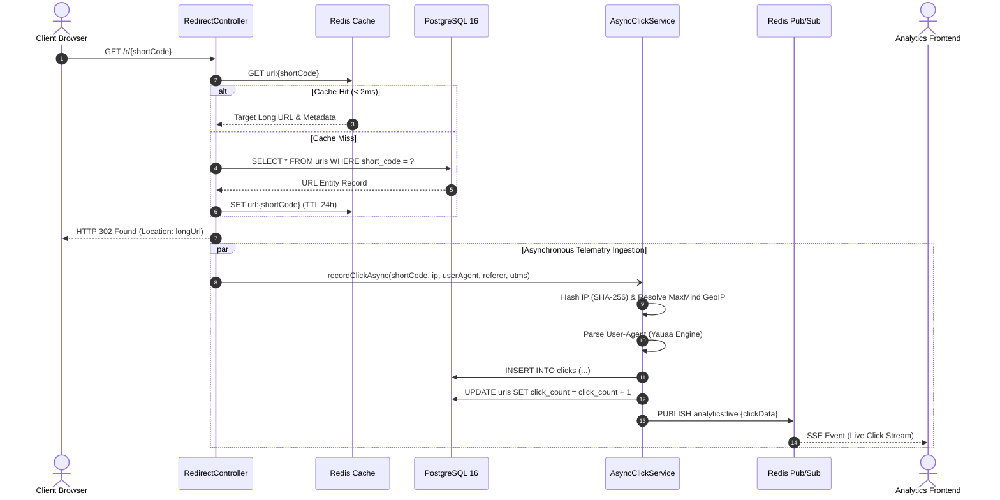

---

## Database Schema and Entity Relationship Diagram (ERD)

Trimly utilizes PostgreSQL 16 with indexed foreign keys, array types (`text[]` for tags and channels), and timestamp indexes optimized for analytical slicing.

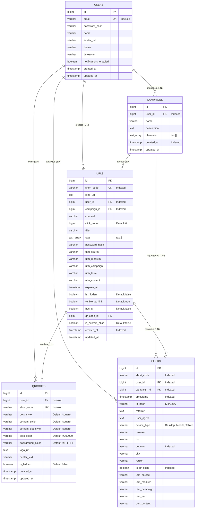

---

## Complete REST API Reference

All requests and responses use JSON. Authenticated endpoints require `Authorization: Bearer <accessToken>`.

### 1. Authentication and User Profile (`/api/auth`, `/api/users`)

| Method | Endpoint | Description | Auth Required |
| :--- | :--- | :--- | :---: |
| `POST` | `/api/auth/register` | Register a new user account | No |
| `POST` | `/api/auth/login` | Log in and receive access token | No |
| `GET` | `/api/auth/me` | Fetch authenticated user profile | Yes |
| `GET` | `/api/users/profile` | Retrieve comprehensive user details | Yes |
| `PATCH` | `/api/users/profile` | Update profile information (name, avatar) | Yes |
| `PATCH` | `/api/users/preferences` | Update preferences (theme, timezone) | Yes |
| `POST` | `/api/users/change-password`| Update user account password | Yes |
| `DELETE`| `/api/users/account` | Permanently delete user account and all links | Yes |

### 2. URL Lifecycle and Redirections (`/api/urls`, `/r`)

| Method | Endpoint | Description | Auth Required |
| :--- | :--- | :--- | :---: |
| `GET` | `/r/{shortCode}` | **High-speed cached 302 redirect** | No |
| `POST` | `/api/urls` | Create short link (auto-token or custom alias) | Optional |
| `GET` | `/api/urls` | List user short links with filtering | Yes |
| `GET` | `/api/urls/{code}` | Get short link metadata and status | Yes |
| `PATCH` | `/api/urls/{code}` | Update title, tags, expiration, or password | Yes |
| `POST` | `/api/urls/{code}/edit-back-half` | Modify custom alias with collision guard | Yes |
| `POST` | `/api/urls/{code}/verify-password` | Verify password on protected short link | No |
| `DELETE`| `/api/urls/{code}` | Delete short link and invalidate cache | Yes |
| `GET` | `/api/urls/tags` | Retrieve all distinct tags used by user | Yes |
| `PATCH` | `/api/urls/bulk-tags` | Batch add/remove tags across links | Yes |
| `PATCH` | `/api/urls/bulk-hide` | Batch hide/unhide links from dashboard | Yes |

### 3. Branded QR Code Studio (`/api/qrcodes`)

| Method | Endpoint | Description | Auth Required |
| :--- | :--- | :--- | :---: |
| `POST` | `/api/qrcodes` | Create & customize styled QR code (SVG + PNG) | Yes |
| `GET` | `/api/qrcodes` | Retrieve all user QR codes | Yes |
| `GET` | `/api/qrcodes/{code}` | Download QR code raster (`format=png`) or vector (`format=svg`) | No |
| `GET` | `/api/qrcodes/{code}/details` | Get QR code configuration and SVG markup | Yes |
| `PATCH` | `/api/qrcodes/{code}` | Update styling (dots, corners, colors, center text) | Yes |
| `POST` | `/api/qrcodes/{code}/duplicate` | Duplicate QR styling onto another short link | Yes |
| `DELETE`| `/api/qrcodes/{code}` | Delete QR code configuration | Yes |

### 4. Marketing Campaigns (`/api/campaigns`)

| Method | Endpoint | Description | Auth Required |
| :--- | :--- | :--- | :---: |
| `POST` | `/api/campaigns` | Create a multi-channel campaign | Yes |
| `GET` | `/api/campaigns` | List all user campaigns with aggregated stats | Yes |
| `GET` | `/api/campaigns/{id}` | Get campaign details and channel link rollups | Yes |
| `PATCH` | `/api/campaigns/{id}` | Update campaign name, description, or channels | Yes |
| `DELETE`| `/api/campaigns/{id}` | Delete campaign and unlink associated short links | Yes |
| `POST` | `/api/campaigns/{id}/links` | Batch generate UTM-tagged links per channel | Yes |
| `POST` | `/api/campaigns/{id}/assign-links` | Assign existing short links to campaign | Yes |
| `DELETE`| `/api/campaigns/{id}/links/{linkId}` | Unlink a short link from campaign | Yes |

### 5. Analytics and Click Intelligence (`/api/analytics`)

| Method | Endpoint | Description | Auth Required |
| :--- | :--- | :--- | :---: |
| `GET` | `/api/analytics` | Get dashboard metrics (summary, time series, geo, devices) | Yes |
| `GET` | `/api/analytics/{code}` | Get analytics for a specific short code | Yes |
| `GET` | `/api/analytics/recent` | Get top 20 recent live click events | Yes |
| `GET` | `/api/analytics/live` | **Live SSE Stream** of real-time clicks via Redis Pub/Sub | Yes |
| `GET` | `/api/analytics/logs` | Paginated click telemetry audit logs | Yes |

### 6. Health Probe (`/api/health`)

| Method | Endpoint | Description | Auth Required |
| :--- | :--- | :--- | :---: |
| `GET` | `/api/health` | Comprehensive health check (Database & Redis ping) | No |

---

## Complete Project Directory Layout

```text
trimly-backend-java-v2/
├── .mvn/wrapper/
│   ├── maven-wrapper.jar                           # Maven wrapper execution binary
│   └── maven-wrapper.properties                    # Maven wrapper distribution settings
├── docs/assets/
│   ├── images/                                     # High-resolution production UI screenshots
│   │   ├── 01-analytics-kpi-timeseries.png         # Analytics KPIs and 14-day engagement curves
│   │   ├── 02-analytics-live-telemetry-sse.png     # Real-time Server-Sent Events (SSE) telemetry feed
│   │   ├── 03-analytics-sources-device-distribution.png # Traffic sources bar chart and device donut
│   │   ├── 04-analytics-geo-cities-utm-tracking.png # City-level GeoIP intelligence and UTM tracking
│   │   ├── 05-qr-code-studio-customizer.png        # Java 2D vector QR studio customizer
│   │   ├── 06-qr-code-details-dynamic-routing.png  # QR code inspection and dynamic routing rules
│   │   ├── 07-qr-code-gallery-management.png       # Centralized visual QR inventory with live metrics
│   │   ├── 08-campaigns-overview-matrix.png        # Omnichannel campaigns hub with channel badges
│   │   ├── 09-campaign-deepdive-attribution.png    # Granular campaign click-share distribution
│   │   ├── 10-home-dashboard-quick-create.png      # Trimly command center and rapid link shortener
│   │   ├── 11-spring-boot-architecture-ide.png     # Java 25 & Spring Boot 4 DDD architecture in IntelliJ
│   │   └── 12-docker-infrastructure-containers.png # Dockerized PostgreSQL 16 and Redis 7 containers
│   ├── README.txt                                  # Visual assets manifest and catalog
│   └── trimly-logo.svg                             # Official vector brand logo
├── src/
│   ├── main/
│   │   ├── java/com/trimly/api/
│   │   │   ├── config/                             # Enterprise configuration beans
│   │   │   │   ├── AsyncConfig.java                # ThreadPoolTaskExecutor async worker pool setup
│   │   │   │   ├── DatabaseInitializer.java        # PostgreSQL sequence and schema initialization
│   │   │   │   ├── JacksonConfig.java              # JSON ObjectMapper serialization tuning
│   │   │   │   ├── OpenApiConfig.java              # SpringDoc OpenAPI 3.0 & Swagger UI definitions
│   │   │   │   ├── RedisConfig.java                # Lettuce connection factory & RedisTemplate config
│   │   │   │   ├── SecurityConfig.java             # Spring Security 7 filter chain & BCrypt encoder
│   │   │   │   └── WebMvcConfig.java               # Global CORS configuration and interceptors
│   │   │   ├── controller/                         # REST API endpoints
│   │   │   │   ├── AnalyticsController.java        # Analytics KPIs, time-series, and SSE live stream
│   │   │   │   ├── AuthController.java             # Registration, login, and token verification
│   │   │   │   ├── CampaignController.java         # Multi-channel campaign CRUD and attribution
│   │   │   │   ├── HealthController.java           # Health probes for DB and Redis connectivity
│   │   │   │   ├── QrCodeController.java           # QR studio creation, styling, and vector download
│   │   │   │   ├── RedirectController.java         # Sub-15ms cached HTTP 302 redirect hot path
│   │   │   │   ├── UrlController.java              # Short URL lifecycle, bulk operations, and back-half
│   │   │   │   └── UserController.java             # User profile, preferences, and account deletion
│   │   │   ├── dto/                                # Strongly-typed Data Transfer Objects
│   │   │   │   ├── request/                        # Validated incoming payload records
│   │   │   │   │   ├── AddCampaignLinksRequest.java
│   │   │   │   │   ├── AssignExistingLinksRequest.java
│   │   │   │   │   ├── BulkHideRequest.java
│   │   │   │   │   ├── BulkTagsRequest.java
│   │   │   │   │   ├── ChangePasswordRequest.java
│   │   │   │   │   ├── CreateCampaignRequest.java
│   │   │   │   │   ├── CreateQrCodeRequest.java
│   │   │   │   │   ├── CreateUrlRequest.java
│   │   │   │   │   ├── DeleteAccountRequest.java
│   │   │   │   │   ├── DuplicateQrCodeRequest.java
│   │   │   │   │   ├── EditBackHalfRequest.java
│   │   │   │   │   ├── LoginRequest.java
│   │   │   │   │   ├── RegisterRequest.java
│   │   │   │   │   ├── UpdateCampaignRequest.java
│   │   │   │   │   ├── UpdatePreferencesRequest.java
│   │   │   │   │   ├── UpdateProfileRequest.java
│   │   │   │   │   ├── UpdateQrCodeRequest.java
│   │   │   │   │   ├── UpdateUrlRequest.java
│   │   │   │   │   └── VerifyPasswordRequest.java
│   │   │   │   └── response/                       # Typed outbound API response structures
│   │   │   │       ├── analytics/
│   │   │   │       │   ├── AnalyticsDashboardResponse.java # Comprehensive metrics rollup
│   │   │   │       │   └── ClickLogResponse.java   # Telemetry event audit record
│   │   │   │       ├── AuthResponse.java           # JWT bearer token container
│   │   │   │       ├── CampaignDetailsResponse.java # Campaign with channel-level stats
│   │   │   │       ├── CampaignResponse.java       # High-level campaign summary
│   │   │   │       ├── ExportJobResponse.java      # Asynchronous data export container
│   │   │   │       ├── QrCodeResponse.java         # QR code configuration & SVG payload
│   │   │   │       ├── UrlResponse.java            # Short URL metadata and tags
│   │   │   │       └── UserResponse.java           # User profile and preference details
│   │   │   ├── exception/                          # Global exception hierarchy and error handling
│   │   │   │   ├── ApiException.java               # Base runtime application exception
│   │   │   │   ├── BadRequestException.java        # HTTP 400 bad request wrapper
│   │   │   │   ├── ConflictException.java          # HTTP 409 unique constraint violation
│   │   │   │   ├── ErrorResponse.java              # Standardized API error response format
│   │   │   │   ├── ForbiddenException.java         # HTTP 403 access denied exception
│   │   │   │   ├── GlobalExceptionHandler.java     # @ControllerAdvice central error handler
│   │   │   │   ├── ResourceNotFoundException.java  # HTTP 404 entity not found exception
│   │   │   │   └── UnauthorizedException.java      # HTTP 401 unauthenticated exception
│   │   │   ├── model/entity/                       # JPA Relational Entities
│   │   │   │   ├── BaseEntity.java                 # JPA Auditing base (id, createdAt, updatedAt)
│   │   │   │   ├── Campaign.java                   # Marketing campaign entity
│   │   │   │   ├── Click.java                      # Raw click telemetry stream entity
│   │   │   │   ├── QrCode.java                     # Custom QR code configuration entity
│   │   │   │   ├── Url.java                        # Core short URL entity
│   │   │   │   └── User.java                       # User identity and profile entity
│   │   │   ├── repository/                         # Spring Data JPA Repositories
│   │   │   │   ├── CampaignRepository.java         # Campaign queries with channel aggregations
│   │   │   │   ├── ClickRepository.java            # Time-series and analytical queries
│   │   │   │   ├── QrCodeRepository.java           # QR code configuration persistence
│   │   │   │   ├── UrlRepository.java              # Indexed URL lookup and atomic increments
│   │   │   │   └── UserRepository.java             # User credential and profile queries
│   │   │   ├── security/                           # Stateless Security and Authentication
│   │   │   │   ├── CustomUserDetailsService.java   # Spring Security user loader
│   │   │   │   ├── JwtAuthenticationFilter.java    # Per-request JWT Bearer token validator
│   │   │   │   ├── JwtTokenProvider.java           # HMAC-SHA512 token generator and parser
│   │   │   │   ├── SecurityUtils.java              # Authentication helpers and IP hashing
│   │   │   │   └── UserPrincipal.java              # Authenticated user representation
│   │   │   ├── seeder/                             # Database Seeding Subsystem
│   │   │   │   ├── DatabaseSeeder.java             # Production-grade mock data seeder engine
│   │   │   │   └── DatabaseSeederApplication.java  # Standalone CLI seeder execution entrypoint
│   │   │   ├── service/                            # Business Logic Service Interfaces
│   │   │   │   ├── impl/                           # Service Implementation Classes
│   │   │   │   │   ├── AnalyticsServiceImpl.java   # Analytics aggregation & Redis SSE publishing
│   │   │   │   │   ├── AsyncClickServiceImpl.java  # Asynchronous telemetry background worker
│   │   │   │   │   ├── AuthServiceImpl.java        # User registration and token issuance
│   │   │   │   │   ├── CampaignServiceImpl.java    # Campaign management & attribution calculation
│   │   │   │   │   ├── QrCodeServiceImpl.java      # Java 2D vector generation & cache layer
│   │   │   │   │   ├── RedirectServiceImpl.java    # Sub-15ms cache-aside redirect pipeline
│   │   │   │   │   ├── UrlServiceImpl.java         # Base62 generation, link lifecycle, tags
│   │   │   │   │   └── UserServiceImpl.java        # Profile preferences & cascade account deletion
│   │   │   │   ├── AnalyticsService.java
│   │   │   │   ├── AsyncClickService.java
│   │   │   │   ├── AuthService.java
│   │   │   │   ├── CampaignService.java
│   │   │   │   ├── QrCodeService.java
│   │   │   │   ├── RedirectService.java
│   │   │   │   ├── UrlService.java
│   │   │   │   └── UserService.java
│   │   │   ├── util/                               # Core Architectural Utilities
│   │   │   │   ├── Base62Util.java                 # Bijective 64-bit Base62 encoder/decoder
│   │   │   │   ├── GeoIpResolverUtil.java          # MaxMind GeoIP2 country/city resolver
│   │   │   │   ├── QrCodeGeneratorUtil.java        # Pure Java 2D vector & raster graphics engine
│   │   │   │   ├── TitleScraperUtil.java           # Jsoup HTML title & OpenGraph metadata scraper
│   │   │   │   └── UserAgentParserUtil.java        # Yauaa hardware, OS, and browser analyzer
│   │   │   └── TrimlyBackendApplication.java       # Spring Boot main application entrypoint
│   │   └── resources/
│   │       └── application.properties              # Server, Database, Redis, and Seeder Config
│   └── test/java/com/trimly/api/                   # Comprehensive Test Suite
│       ├── controller/
│       │   ├── AuthControllerTest.java             # MockMvc authentication unit tests
│       │   ├── RedirectControllerTest.java         # MockMvc redirect and cache tests
│       │   ├── UrlControllerTest.java              # MockMvc URL management tests
│       │   └── UserControllerTest.java             # MockMvc user management tests
│       ├── security/
│       │   └── JwtTokenProviderTest.java           # Token signing and expiration verification
│       ├── util/
│       │   ├── Base62UtilTest.java                 # Bijective encoding/decoding unit tests
│       │   └── QrCodeGeneratorUtilTest.java        # Java 2D SVG/PNG generation unit tests
│       ├── TrimlyBackendApplicationTests.java      # Spring Boot context load tests
│       └── TrimlyE2EIntegrationTest.java           # Full E2E integration test suite
├── docker-compose.yml                              # PostgreSQL 16 & Redis 7 Alpine orchestration
├── pom.xml                                         # Maven dependency and build configuration
├── seed.bat                                        # One-click Windows batch database seeder
├── seed.ps1                                        # One-click PowerShell database seeder
└── README.md                                       # Comprehensive project documentation
```

---

## Getting Started and Local Development

### Prerequisites

- **Java Development Kit**: JDK 25 LTS (or JDK 21+)
- **Build Tool**: Maven 3.9+ (or use the included `./mvnw`)
- **Container Engine**: Docker & Docker Compose (for PostgreSQL 16 and Redis 7)

### Infrastructure Setup (Docker Compose)

Start the PostgreSQL 16 database and Redis 7 cache in detached mode:

```bash
docker compose up -d
```

Verify that the containers are healthy and running:

```bash
docker ps
```

- **PostgreSQL 16**: Port `5432` (`trimly_db`)
- **Redis 7 Alpine**: Port `6379`

### Configuration (application.properties)

The default configuration in `src/main/resources/application.properties` works out of the box with the Docker setup:

```properties
server.port=4000
spring.application.name=trimly-backend

# PostgreSQL Database Configuration
spring.datasource.url=jdbc:postgresql://localhost:5432/trimly_db
spring.datasource.username=trimly_user
spring.datasource.password=trimly_password
spring.datasource.driver-class-name=org.postgresql.Driver
spring.jpa.hibernate.ddl-auto=update
spring.jpa.show-sql=false
spring.jpa.properties.hibernate.dialect=org.hibernate.dialect.PostgreSQLDialect

# Redis Configuration (Lettuce Driver)
spring.data.redis.host=localhost
spring.data.redis.port=6379
spring.data.redis.timeout=2000ms

# JWT Security Configuration (HMAC-SHA512)
jwt.secret=9a3f5b7e2c8d1a4e6f0b3c5d7e9a1b3c5d7e9a1b3c5d7e9a1b3c5d7e9a1b3c5d
jwt.expiration-ms=604800000

# Automated Seeder Configuration
seed.user.email=sk21@gmail.com
seed.user.password=Trimly@341
seed.user.name=Sandeep Kumar
```

### Running the Backend

Start the Spring Boot backend using the Maven wrapper:

```bash
# On Windows:
.\mvnw.cmd spring-boot:run

# On Linux / macOS:
./mvnw spring-boot:run
```

Once initialized, the services are accessible at:
- **Base REST API**: `http://localhost:4000/api`
- **Actuator Health Probe**: `http://localhost:4000/actuator/health`
- **Swagger UI Explorer**: `http://localhost:4000/swagger-ui.html`
- **Live SSE Event Stream**: `http://localhost:4000/api/analytics/live`

### Automated Database Seeder

Trimly includes an automated database seeder that populates a complete, balanced dataset for testing (User Account, 4 Marketing Campaigns, 10 Custom Short Links, 6 Branded Vector QR Codes, and 142 Telemetry Click Events with realistic geographic and device distributions).

To seed the database:

```cmd
# Windows Batch:
seed.bat

# Windows PowerShell:
.\seed.ps1

# Direct Maven Execution:
.\mvnw.cmd spring-boot:run "-Dspring-boot.run.main-class=com.trimly.api.seeder.DatabaseSeederApplication"
```

Default seeded credentials:
- **Email**: `sk21@gmail.com`
- **Password**: `Trimly@341`

### Running the Test Suite and Code Coverage

Execute the complete automated test suite including MockMvc web layer tests, utility unit tests, and E2E integration tests:

```bash
# Run all tests:
.\mvnw.cmd test

# Generate JaCoCo code coverage reports:
.\mvnw.cmd jacoco:report
```

- **Test Suite Results**: 100% test pass rate across unit, repository, security, and MockMvc integration tests.
- **Coverage Report Location**: `target/site/jacoco/index.html`

---

## API Documentation (Swagger UI and OpenAPI 3)

Interactive OpenAPI 3.0 documentation is served directly by SpringDoc when the application is running:

- **Swagger UI**: [http://localhost:4000/swagger-ui.html](http://localhost:4000/swagger-ui.html)
- **OpenAPI JSON Specification**: [http://localhost:4000/api/docs](http://localhost:4000/api/docs)

To test authenticated endpoints in Swagger UI:
1. Call `POST /api/auth/login` to obtain an `accessToken`.
2. Click the green **Authorize** button at the top of Swagger UI.
3. Enter `Bearer <your_access_token>` and click **Authorize**.

---

## Contributing and License

Contributions, bug reports, and architectural proposals are welcome.

1. Fork the repository.
2. Create your feature branch (`git checkout -b feature/distributed-rate-limiter`).
3. Commit your changes (`git commit -m 'feat: implement distributed token bucket rate limiter'`).
4. Push to the branch (`git push origin feature/distributed-rate-limiter`).
5. Open a Pull Request.

This project is licensed under the [MIT License](LICENSE).

---

## Author and Contact

**Sandeep Kumar**

- **LinkedIn**: [https://www.linkedin.com/in/sandeep-kumar-s21](https://www.linkedin.com/in/sandeep-kumar-s21)
- **GitHub**: [https://github.com/sandeep-kumar-21](https://github.com/sandeep-kumar-21)
- **Email**: [sandeepkumarnitrr@gmail.com](mailto:sandeepkumarnitrr@gmail.com)

*Inspired by Bitly, Trimly Backend was architected and built as a full-stack portfolio demonstration of production-grade distributed backend architecture, asynchronous message streaming, pure Java 2D vector geometry rendering, and high-throughput caching patterns.*
